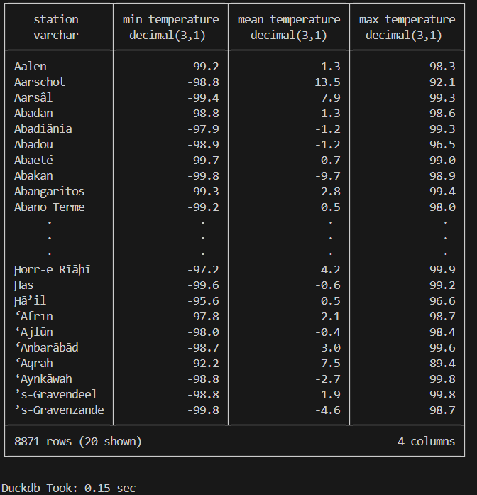

## Objetivo do projeto:

    Este projeto tem como objetivo de utilizar a biblioteca DuckDB para ler um arquivo de 1B linhas na máquina local.

    Este desafio foi inspirado no [The One Billion Row Challenge](https://github.com/gunnarmorling/1brc), originalmente proposto para Java.

    O arquivo de dados consiste em medições de temperatura de várias estações meteorológicas. Cada registro segue o formato <string: nome da estação>;<double: medição>`, com a temperatura sendo apresentada com precisão de uma casa decimal.

    Aqui estão dez linhas de exemplo do arquivo:

    Hamburg;12.0
    Bulawayo;8.9
    Palembang;38.8
    St. Johns;15.2
    Cracow;12.6
    Bridgetown;26.9
    Istanbul;6.2
    Roseau;34.4
    Conakry;31.2
    Istanbul;23.0

    O desafio é desenvolver um programa Python capaz de ler esse arquivo e calcular a temperatura mínima, média (arredondada para uma casa decimal) e máxima para cada estação, exibindo os resultados em uma tabela ordenada por nome da estação.

    | station      | min_temperature | mean_temperature | max_temperature |
    |--------------|-----------------|------------------|-----------------|
    | Abha         | -31.1           | 18.0             | 66.5            |
    | Abidjan      | -25.9           | 26.0             | 74.6            |
    | Abéché       | -19.8           | 29.4             | 79.9            |
    | Accra        | -24.8           | 26.4             | 76.3            |
    | Addis Ababa  | -31.8           | 16.0             | 63.9            |
    | Adelaide     | -31.8           | 17.3             | 71.5            |
    | Aden         | -19.6           | 29.1             | 78.3            |
    | Ahvaz        | -24.0           | 25.4             | 72.6            |
    | Albuquerque  | -35.0           | 14.0             | 61.9            |
    | Alexandra    | -40.1           | 11.0             | 67.9            |
    | ...          | ...             | ...              | ...             |
    | Yangon       | -23.6           | 27.5             | 77.3            |
    | Yaoundé      | -26.2           | 23.8             | 73.4            |
    | Yellowknife  | -53.4           | -4.3             | 46.7            |
    | Yerevan      | -38.6           | 12.4             | 62.8            |
    | Yinchuan     | -45.2           | 9.0              | 56.9            |
    | Zagreb       | -39.2           | 10.7             | 58.1            |
    | Zanzibar City| -26.5           | 26.0             | 75.2            |
    | Zürich       | -42.0           | 9.3              | 63.6            |
    | Ürümqi       | -42.1           | 7.4              | 56.7            |
    | İzmir        | -34.4           | 17.9             | 67.9            |

## Dependências

    Para executar os scripts deste projeto, você precisará da seguinte biblioteca:

    * DuckDB: `1.1.3`

## Resultados

    O teste foi executado em um laptop com o processador 'AMD Ryzen 7 3700U com Radeon Vega Mobile Gfx, 2300 MHz, 4 núcleos e 8 threads'. A implementação foi realizada utilizando o banco de dados 'DuckDB'. 
    Abaixo estão apresentados os resultados e o tempo de execução:

## Conclusão

Este desafio destacou claramente a eficácia da biblioteca DuckDB na manipulação de grandes volumes de dados.

## Como Executar

Para executar este projeto e reproduzir os resultados:

1. Clone esse repositório
2. Definir a versao do Python usando o `pyenv local 3.13.1` e  `poetry env use 3.13.1`
3. Execute o comando `source .venv/Scripts/activate` depois de ativar o seu ambiente  `python projectduckdb_01/geradados.py` para gerar o arquivo de teste
4. Tenha paciência e vá fazer um café, vai demorar uns 10 minutos para gerar o arquivo
5. Certifique-se de instalar a versão especificada da biblioteca DuckDB
6. Execute o script após a geração do arquivo `python projectduckdb_01/__init__.py` através de um terminal ou ambiente de desenvolvimento que suporte Python.